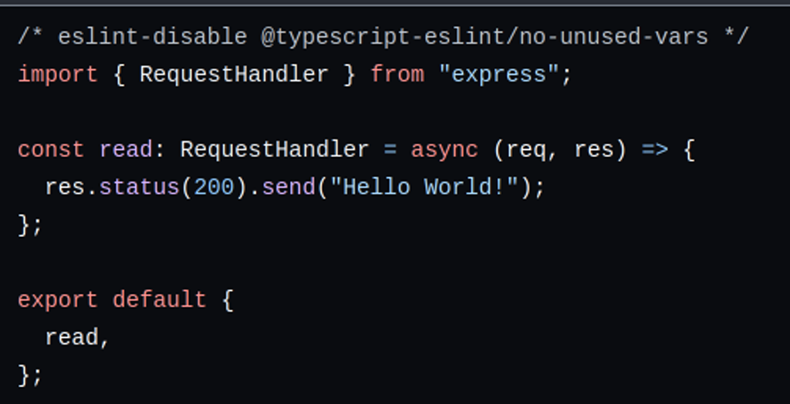
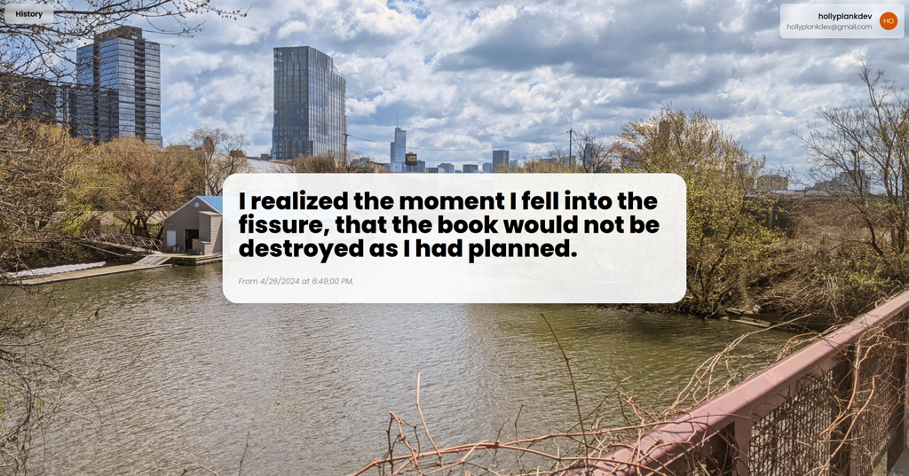

# About Me
<a href="https://www.linkedin.com/in/hollyplankdev/"> Connect with me on LinkedIn!</a>

Hey, I'm Holly Plank - a Software Developer passionate for backend engineering and real-time interactive applications. Previously a Unity3D Developer and Firmware Engineer, I am currently seeking a role as Backend Engineer to work on networked applications at scale. My ability to both work well with others and execute self-sufficiently makes me a powerful and flexible asset to any team!

# Projects to Check Out
|  |  |
:-:|:-:
|  [Hello World API](https://github.com/hollyplankdev/hello-world-api-ts) | [Message of the Day API](https://github.com/hollyplankdev/motd-api-ts) |
|  |  |
| A basic "Hello World" ExpressJS TypeScript backend project. | A web app using the MERN stack that shows you the most recently posted Message of the Day. |

# Stuff I've Used and Like
- Programming Languages / Libraries / Frameworks
    - ⭐ C#
    - ⭐ TypeScript/JavaScript
    - ⭐ C
    - ⭐ Python
    - C++
    - Java
- Version Control
    - ⭐ Git
    - Perforce
- Databases
    - ⭐ MongoDB
    - ⭐ DynamoDB
    - MySQL
- Project Management
    - ⭐ Atlassian Suite
        - Jira
        - Confluence
    - GitHub Projects
    - Trello
    - SmartSheet

<!-- Thank you to colored-icons for the social media icons! https://github.com/dheereshagrwal/colored-icons -->
<!--
**hollyplankdev/hollyplankdev** is a ✨ _special_ ✨ repository because its `README.md` (this file) appears on your GitHub profile.

Here are some ideas to get you started:

- 🔭 I’m currently working on ...
- 🌱 I’m currently learning ...
- 👯 I’m looking to collaborate on ...
- 🤔 I’m looking for help with ...
- 💬 Ask me about ...
- 📫 How to reach me: ...
- 😄 Pronouns: ...
- ⚡ Fun fact: ...
-->
